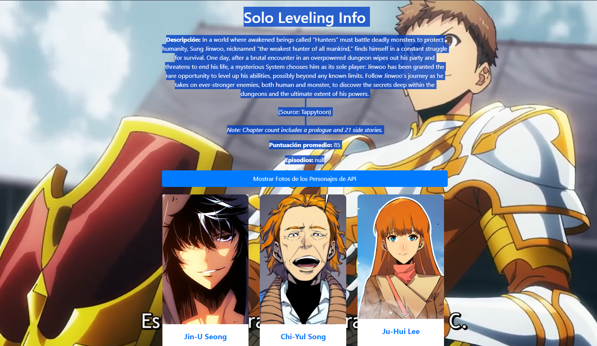

### Proyecto: Explorador de Información de Anime 🌟

---



#### Ver la Web: https://juancitopena.github.io/Solo_Leveling_API/

El proyecto "Explorador de Información de Anime" es una aplicación web que utiliza la API de AniList para obtener datos detallados sobre anime y mostrarlos de manera interactiva en una página web. Esta aplicación permite a los usuarios buscar información sobre sus anime favoritos, incluyendo detalles sobre el título, descripción, puntuación promedio, episodios y personajes destacados.

### Narrativa 📖
---
Imagina que eres un estudiante de desarrollo web apasionado por el mundo del anime. Un día, mientras buscabas formas de practicar tus habilidades en HTML, CSS y JavaScript, te enteras de la API de AniList, que proporciona acceso a una amplia gama de datos sobre anime. Inspirado por esta oportunidad, decides crear un proyecto que combine tus habilidades de desarrollo web con tu amor por el anime.

Decides construir un "Explorador de Información de Anime", una aplicación web que permita a los usuarios buscar y explorar información detallada sobre sus anime favoritos. Con la API de AniList a tu disposición, te embarcas en la emocionante aventura de crear una interfaz atractiva y funcional que muestre datos precisos y actualizados sobre anime.

### Requerimientos del Proyecto 🚀
---
Para este proyecto escolar o laboral, se solicita crear una aplicación web utilizando HTML, CSS y JavaScript, que cumpla con los siguientes requisitos:

1. **Interfaz de Usuario Atractiva**: Utilizar HTML y CSS para diseñar una interfaz de usuario atractiva y receptiva que permita a los usuarios interactuar fácilmente con la aplicación.

2. **Consumo de API de AniList**: Utilizar JavaScript para realizar solicitudes a la API de AniList y obtener datos relevantes sobre anime, incluyendo título, descripción, puntuación promedio, episodios y personajes.

3. **Presentación de Datos Dinámica**: Mostrar la información obtenida de la API de AniList de forma dinámica en la interfaz de usuario, utilizando técnicas de manipulación del DOM.

4. **Estilos Responsivos**: Utilizar CSS para crear estilos responsivos que se adapten a diferentes tamaños de pantalla y dispositivos. Implementar un diseño que garantice una experiencia de usuario óptima en dispositivos móviles, tabletas y computadoras de escritorio.

5. **Documentación y Presentación**: Crear un archivo README.md utilizando formato Markdown que incluya una descripción detallada del proyecto, instrucciones de instalación y uso, capturas de pantalla de la aplicación en funcionamiento y cualquier otra información relevante para los usuarios y desarrolladores.

### Tecnologías Utilizadas 💻
---
- **HTML (HyperText Markup Language)**: Lenguaje de marcado utilizado para estructurar y organizar el contenido de la página web.

- **CSS (Cascading Style Sheets)**: Lenguaje de estilo utilizado para diseñar y dar formato a la apariencia visual de la página web.

- **JavaScript**: Lenguaje de programación utilizado para agregar interactividad y funcionalidad dinámica a la aplicación web.

- **AniList API**: Interfaz de programación de aplicaciones que proporciona acceso a datos detallados sobre anime, incluyendo información sobre títulos, descripciones, puntuaciones y personajes.

### GitHub Pages y Vercel 🌐
---
El proyecto está disponible para su visualización en vivo a través de GitHub Pages y Vercel. A continuación se detallan los pasos para desplegarlo en ambas plataformas:

#### GitHub Pages:
---
1. Ve a la pestaña "Settings" de tu repositorio en GitHub.
2. Desplázate hacia abajo hasta la sección "GitHub Pages".
3. Selecciona la rama que deseas publicar (por lo general, la rama "main").
4. Haz clic en "Save" o "Guardar".
5. Tu proyecto estará disponible en la URL proporcionada.

#### Vercel:
---
1. Ve al sitio web de Vercel (https://vercel.com/).
2. Inicia sesión o crea una cuenta nueva si aún no tienes una.
3. Haz clic en "Import Project" y selecciona tu repositorio de GitHub.
4. Configura los ajustes según sea necesario y haz clic en "Deploy".
5. Una vez desplegado, recibirás una URL donde estará disponible tu proyecto.


#### Licencia 📜

---
Este proyecto está bajo la licencia [Nombre de la Licencia](URL de la Licencia).

#### Contribución 🤝

¡Las contribuciones son bienvenidas! Si deseas contribuir a este proyecto, por favor sigue las directrices de [Nombre del Proyecto - Contribución](URL de la Contribución).

#### Cómo Clonar el Proyecto

Para clonar y ejecutar este proyecto localmente, asegúrate de tener [Git](https://git-scm.com) instalado en tu equipo. Luego, ejecuta los siguientes comandos en tu terminal:

```bash
# Clona este repositorio
git clone https://github.com/tu_usuario/nombre_del_repositorio.git

# Accede al directorio del proyecto
cd nombre_del_repositorio

# Abre el archivo index.html en tu navegador web
